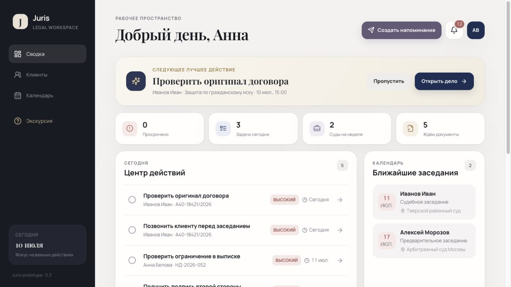

# Juris — CRM для юриста

[Русский](#русский) · [English](#english)

**Живое демо / Live demo:** [valencetests.ru](https://valencetests.ru)



## Русский

Juris — интерактивный CRM-прототип для одного юриста. Он превращает обычный список клиентов в рабочее пространство: показывает приоритетное следующее действие, приближающиеся заседания и сроки, задачи и историю каждого дела.

### Возможности

- воронка клиентов и дел с поиском, фильтрами, сортировкой и сменой статуса;
- создание, редактирование и подтверждённое удаление клиентов;
- центр действий с приоритетами, сроками и рекомендацией следующего шага;
- карточка дела с задачами, событиями, документами и историей;
- персональные Telegram-напоминания, привязанные к клиенту и делу;
- скрываемые уведомления и пропускаемый ознакомительный гайд;
- адаптивный интерфейс для компьютера и телефона;
- изолированное демо-хранилище в Supabase с анонимной авторизацией и RLS.

Отправка сообщений в Telegram и AI-сводки в прототипе имитируются. Все данные синтетические; приложение не предназначено для хранения реальной юридической информации.

### Локальный запуск

Требуется Node.js `22.12.0+`.

```bash
npm ci
npm run dev
```

Откройте `http://localhost:5173`. Vite обращается к локальному Express API на порту `3001`, а демо-данные сохраняются в игнорируемой SQLite-базе.

### Размещение с Supabase

```bash
cp .env.example .env.local
```

Укажите `VITE_SUPABASE_URL` и `VITE_SUPABASE_PUBLISHABLE_KEY`, включите анонимную авторизацию и выполните [`supabase/setup.sql`](supabase/setup.sql) в SQL Editor. Подробная инструкция: [`docs/DEPLOYMENT.md`](docs/DEPLOYMENT.md).

Каждый посетитель получает отдельную анонимную сессию и собственное рабочее пространство. RLS не позволяет читать чужие данные.

### Проверка качества

```bash
npm run check
```

Команда проверяет форматирование, ESLint, Vitest-тесты и production-сборку. Тот же набор выполняется в GitHub Actions.

### Документация

- [`docs/BRIEF.md`](docs/BRIEF.md) — согласованный объём MVP;
- [`docs/ARCHITECTURE.md`](docs/ARCHITECTURE.md) — архитектура и модель безопасности;
- [`docs/DEPLOYMENT.md`](docs/DEPLOYMENT.md) — настройка Supabase и статического хостинга;
- [`SECURITY.md`](SECURITY.md) — ограничения демо и сообщения об уязвимостях.

Стек: React 19, Vite 7, Express 5, Node SQLite, Supabase Postgres/RLS, Vitest, ESLint и Prettier. Лицензия: [MIT](LICENSE).

## English

Juris is an interactive CRM prototype for a solo lawyer. It turns a traditional client list into an action-oriented workspace with prioritized next steps, hearings, deadlines, tasks, and a complete matter history.

### Features

- client and matter pipeline with search, filters, sorting, and status updates;
- client creation, editing, and confirmed deletion;
- action center with priorities, deadlines, and next-best-action suggestions;
- matter drawer with tasks, events, documents, and activity history;
- personal Telegram reminders linked to a client and matter;
- dismissible notifications and a skippable guided product tour;
- responsive desktop and mobile layouts;
- isolated anonymous Supabase workspaces protected by row-level security.

Telegram delivery and AI summaries are intentionally simulated. The repository contains synthetic data only and must not be used for real legal information.

### Quick start

Node.js `22.12.0+` is required.

```bash
npm ci
npm run dev
```

Open `http://localhost:5173`. Vite proxies API calls to the local Express server on port `3001`; demo data is stored in a local ignored SQLite database.

### Hosted Supabase mode

```bash
cp .env.example .env.local
```

Set `VITE_SUPABASE_URL` and `VITE_SUPABASE_PUBLISHABLE_KEY`, enable anonymous sign-ins, and run [`supabase/setup.sql`](supabase/setup.sql) in the Supabase SQL editor. See [`docs/DEPLOYMENT.md`](docs/DEPLOYMENT.md) for the full setup.

Each visitor receives a separate anonymous session and workspace. RLS prevents access to another visitor's data.

### Quality checks

```bash
npm run check
```

This command verifies formatting, ESLint rules, Vitest tests, and the production build. The same check runs in GitHub Actions.

### Documentation

- [`docs/BRIEF.md`](docs/BRIEF.md) — agreed MVP scope;
- [`docs/ARCHITECTURE.md`](docs/ARCHITECTURE.md) — architecture and security model;
- [`docs/DEPLOYMENT.md`](docs/DEPLOYMENT.md) — Supabase and static hosting setup;
- [`SECURITY.md`](SECURITY.md) — demo limitations and security reporting.

Stack: React 19, Vite 7, Express 5, Node SQLite, Supabase Postgres/RLS, Vitest, ESLint, and Prettier. License: [MIT](LICENSE).
